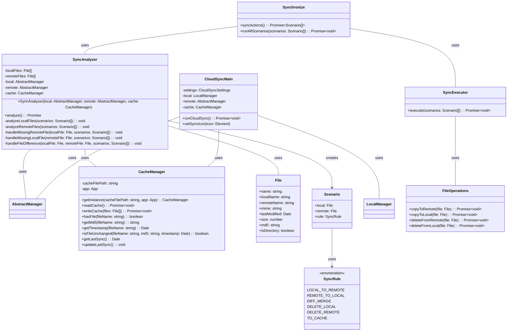

# Sync Class Diagram



# Cloud Provider Class Diagram

```mermaid
classDiagram
    AbstractManager <|-- LocalManager : extends
    AbstractManager <|-- AWSManager : extends
    AbstractManager <|-- AzureManager : extends
    AbstractManager <|-- GCPManager : extends

    class AbstractManager {
        +name: string
        +files: File[]
        +lastScan: Date
        #settings: CloudSyncSettings
        +testConnectivity(): Promise~ConnectionResult~
        +authenticate(): Promise~void~
        +getFiles(): Promise~File[]~
        +readFile(file: File): Promise~Buffer~
        +writeFile(file: File, content: Buffer): Promise~void~
        +deleteFile(file: File): Promise~void~
        +scan(): Promise~void~
        +setLastScan(date: Date): void
        +getLastSync(): Date
    }

    class LocalManager {
        +name: "Local"
        -basePath: string
        -vaultName: string
        -hashCache: Record<string, HashCacheEntry>
        -app: App
        -cache: CacheManager
        +getBasePath(): string
        +getApp(): App
        +getVaultName(): string
        -getDefaultIgnoreList(): string[]
        -normalizeVaultPath(path: string): string
        -ensureDirectoryExists(filePath: string): Promise~void~
        -computeHashStreaming(relativePath: string): Promise~string~
        -getFileHashAndMimeType(filePath: string, stats: FileStats, normalizedPath: string): Promise~HashInfo~
        -normalizePathForCloud(path: string): string
        -getIgnoreList(): string[]
        -processFileBatch(filePaths: string[]): Promise~File[]~
    }

    class AWSManager {
        +name: "AWS"
        -bucket: string
        -region: string
        -accessKey: string
        -secretKey: string
        -endpoint: string
        -auth: AWSAuth
        -signing: AWSSigning
        -fileOps: AWSFiles
        -paths: AWSPaths
        -vaultPrefix: string
        -validateSettings(): void
        -initializeClient(skipRegionDiscovery: boolean): Promise~void~
        +discoverRegion(): Promise~string~
    }

    class AzureManager {
        +name: "Azure"
        -containerName: string
        -paths: AzurePaths
        -auth: AzureAuth
        -fileOps: AzureFiles
        -validateSettings(): void
        -initializeClient(): Promise~void~
    }

    class GCPManager {
        +name: "GCP"
        -bucket: string
        -vaultPrefix: string
        -paths: GCPPathHandler
        -auth: GCPAuth
        -fileOps: GCPFiles
        -currentSession: GCPSession
        -validateSettings(): void
        -initializeClient(): Promise~void~
        -ensureSession(): Promise~void~
        +startSyncSession(): Promise~void~
    }
