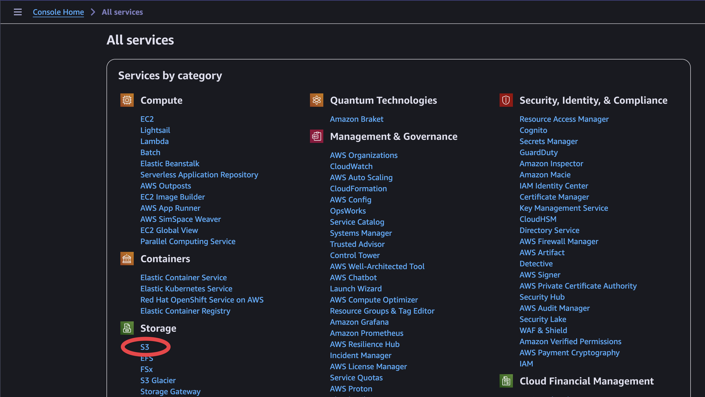
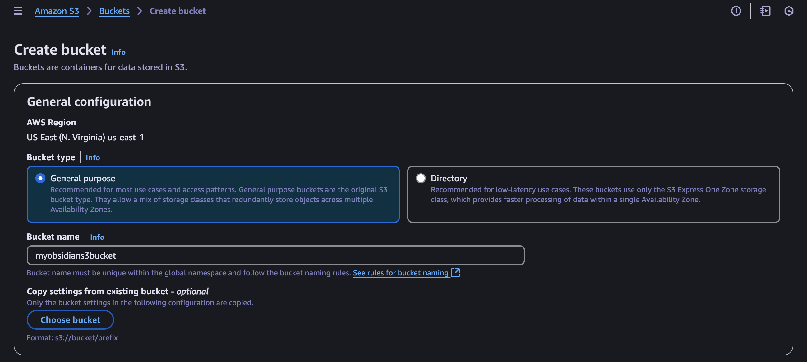
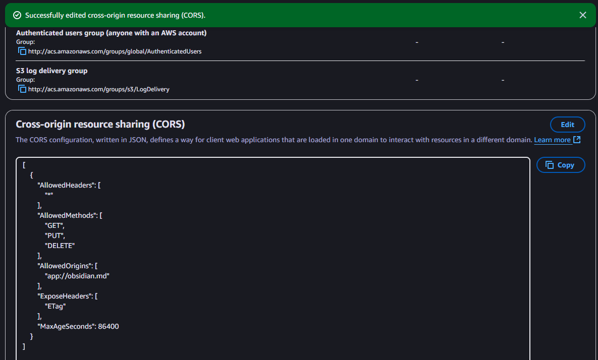
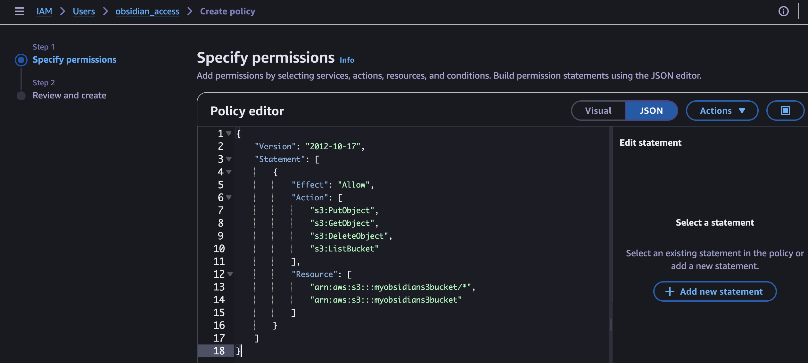
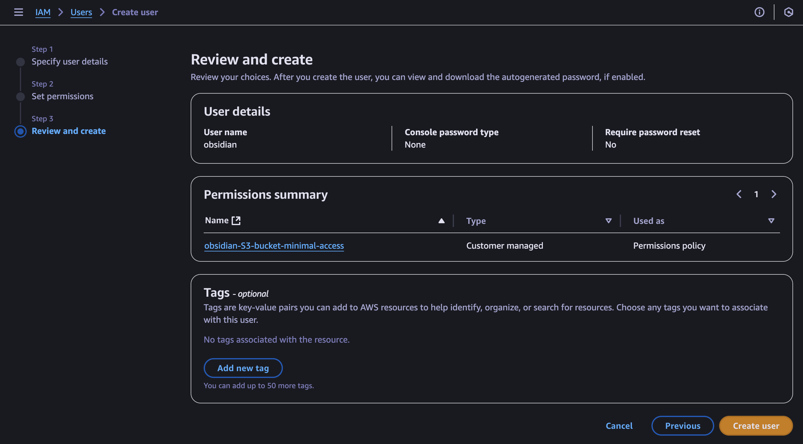
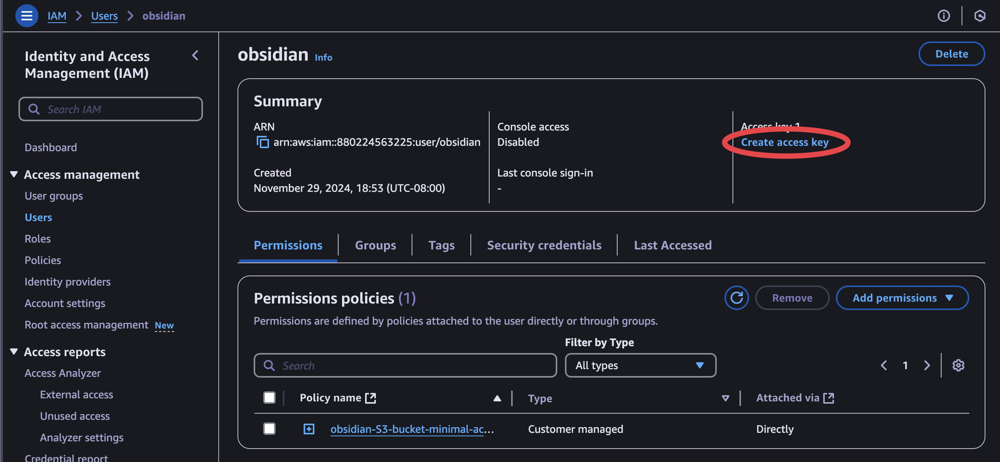
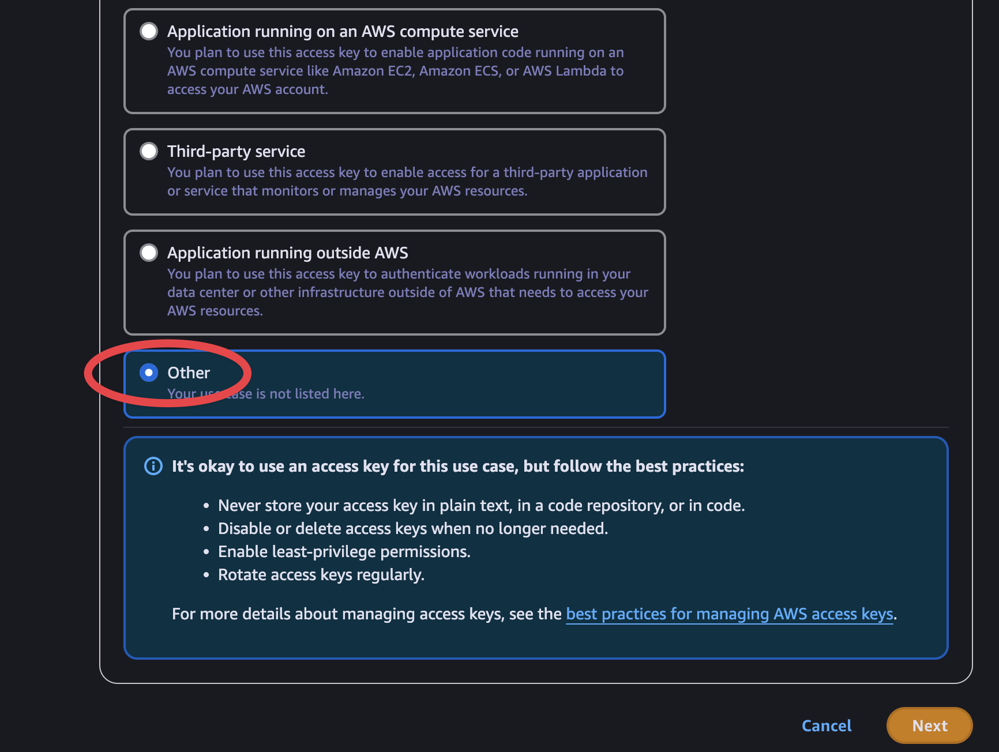
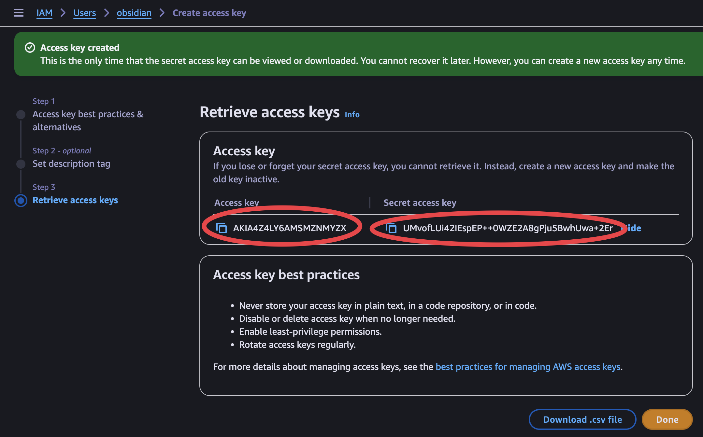
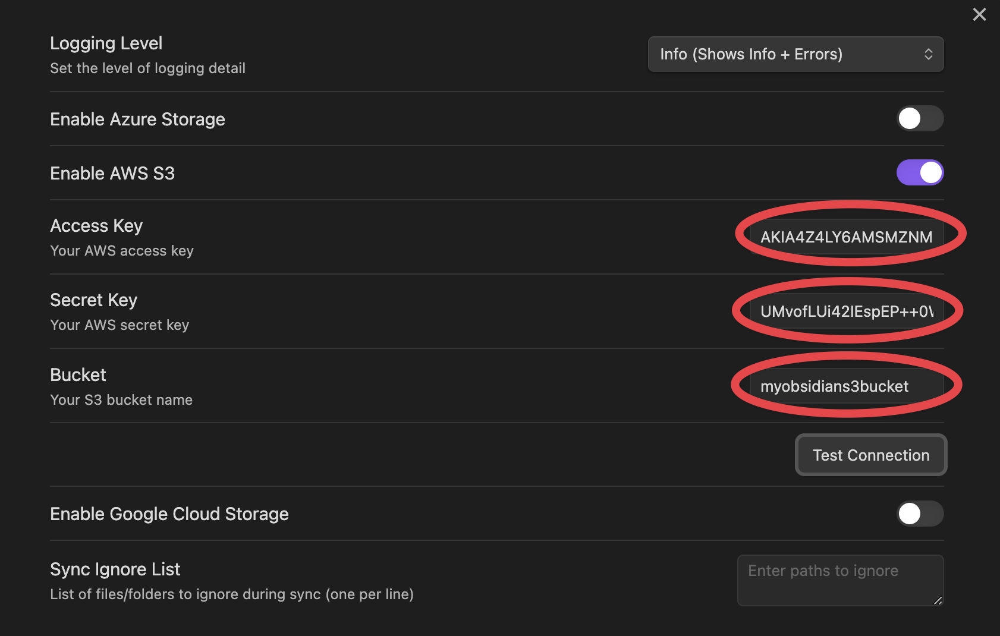

## Sign in to AWS Management Console
   - Make sure you have an AWS account with appropriate permissions
   - You can use an existing S3 bucket (skip to [Configure CORS for your S3 bucket](#configure-cors-for-your-s3-bucket)) or create a new S3 bucket



## Create an S3 bucket
   - Navigate to S3 in the AWS Console
   - Click "Create bucket"
   - Choose a unique bucket name (must be globally unique across all AWS)
	   - One S3 bucket can host multiple Obsidian vaults - each in its own directory
   - Keep all default settings on the form
   - Click "Create bucket" at the bottom of the form



## Configure CORS for your S3 bucket
   - Select your bucket and go to the "Permissions" tab
   - Scroll down to the "Cross-origin resource sharing (CORS)" section
   - Click "Edit" and add the following CORS configuration:
```json
[
    {
        "AllowedHeaders": ["*"],
        "AllowedMethods": ["GET", "PUT", "DELETE"],
        "AllowedOrigins": ["app://obsidian.md"],
        "ExposeHeaders": ["ETag"],
        "MaxAgeSeconds": 86400
    }
]
```


## Create IAM credentials for CloudSync
   - Go to IAM in the AWS Console
   - Create a new IAM user or use an existing one
   - Add the following IAM policy to the user (replace `your-bucket-name` with your actual bucket name):
```json
{
    "Version": "2012-10-17",
    "Statement": [
        {
            "Effect": "Allow",
            "Action": [
                "s3:PutObject",
                "s3:GetObject",
                "s3:DeleteObject",
                "s3:ListBucket"
            ],
            "Resource": [
                "arn:aws:s3:::your-bucket-name/*",
                "arn:aws:s3:::your-bucket-name"
            ]
        }
    ]
}
```




## Get your AWS credentials
   - After creating the IAM user, Create access key:

   - at "Access key best practices & alternatives" choose **Other**




   - save the following credentials:
     - Access Key ID
     - Secret Access Key (note: this is the only time you'll see Secret key)
     - S3 Bucket name

## Configure CloudSync settings
   - Enter your AWS credentials in the CloudSync settings
   - Test the connection


If setup is correct, you should see the message: **AWS connection test successful**

Note: Make sure to never share your AWS credentials and store them securely. It's recommended to use an IAM user with minimal required permissions rather than root credentials.
