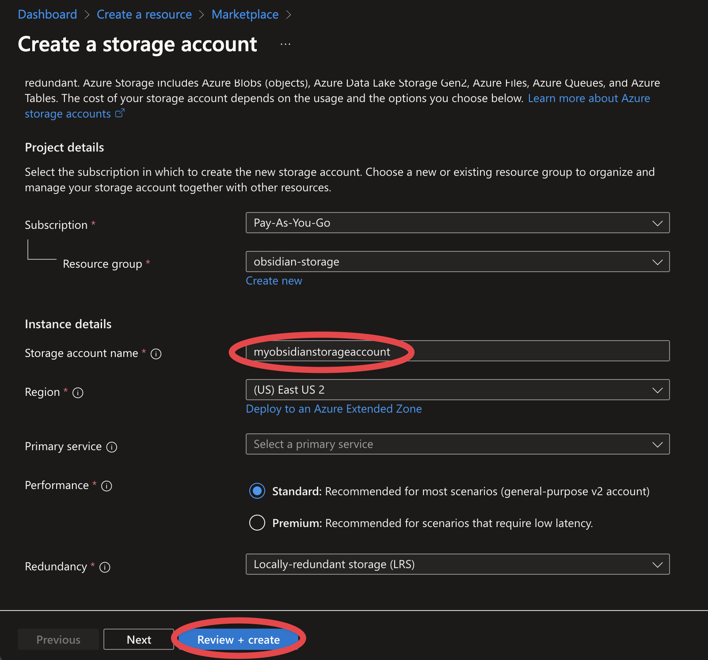
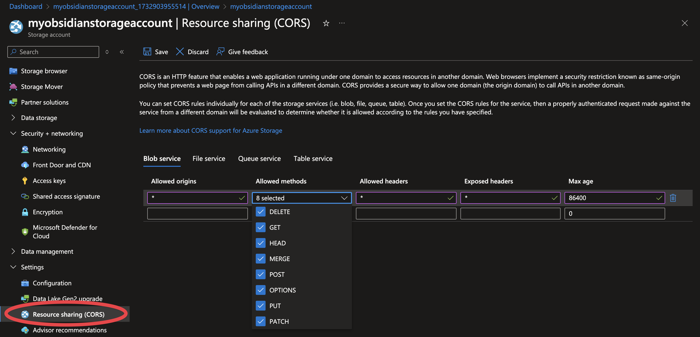
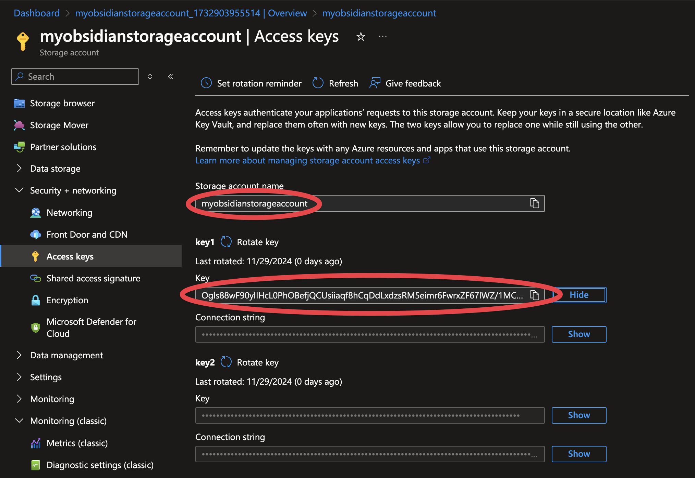
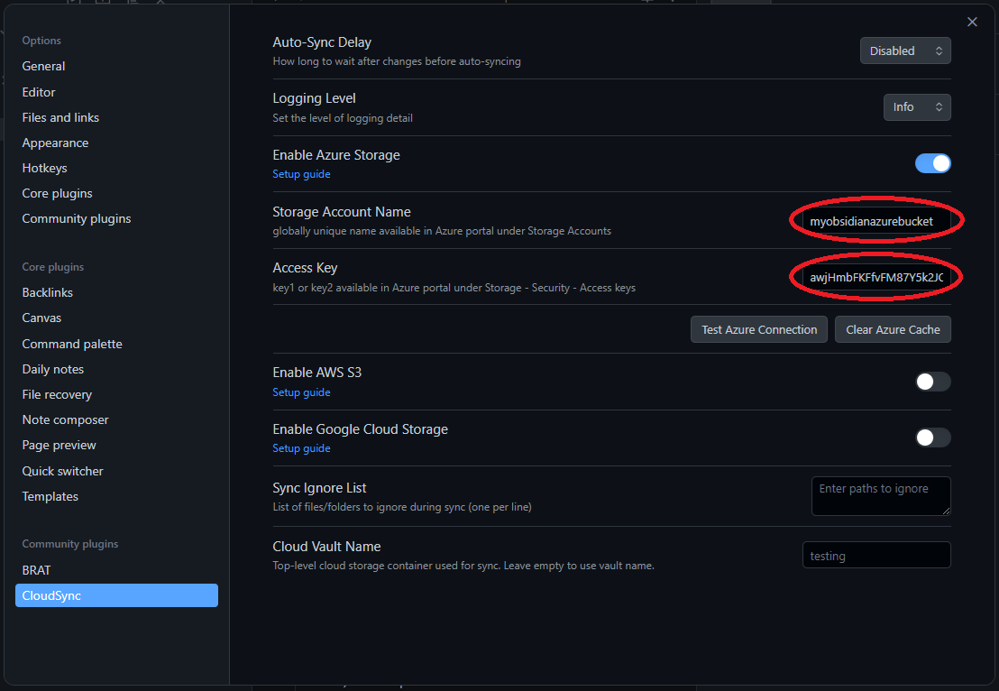

## Sign in to Azure Portal
- Make sure that your Azure subscription allows Azure storage
- You can reuse existing Storage Account (skip to Configure CORS)

## Create a Storage Account
- Storage account name has to be **globally** unique
- One storage account will host many Obsidian vaults - each one in its own blob container
- Choose the name of storage account wisely:
    - Length: Must be between 3 and 24 characters
    - Characters allowed: Only lowercase letters and numbers
    - Must be unique across all existing storage accounts in Azure globally
    - Must start with a letter or number
    - Cannot contain hyphens (-) or any special characters
    - Cannot use reserved words or trademarked terms

## Configure CORS Settings
- Go to Azure Portal > Your Storage Account > Settings > Resource sharing (CORS)
- Add a new CORS rule:
    - Allowed origins: *
    - Allowed methods: DELETE, GET, PUT
    - Allowed headers: *
    - Exposed headers: *
    - Max age: 86400

## Get your Azure Credentials
- Navigate to `Access keys` under `Security + networking` and copy the following credentials:
    - Storage Account Name
    - Connection String or Account Key

## Configure CloudSync Settings
- Use these credentials in CloudSync settings and test the connection

If setup is correct, you should see the message: **Azure connection test successful**
