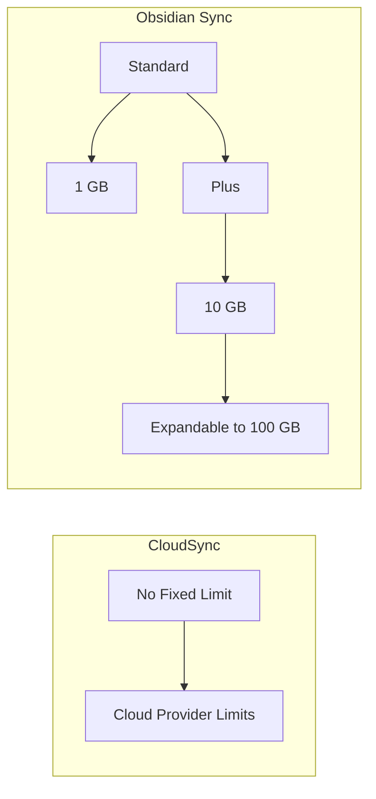

# CloudSync vs Obsidian Sync

This document compares CloudSync's cloud provider synchronization with Obsidian's official Sync service, helping you choose the right solution for your needs.

## Cost Comparison

### Monthly Cost Structure

| Storage Size | CloudSync* | Obsidian Sync (Standard) | Obsidian Sync (Plus) |
|-------------|------------|-------------------------|---------------------|
| 1-5 GB      | $0.10-0.12 | $4-5                   | $8-10              |
| 5-20 GB     | $0.48-0.57 | Not Available          | $8-10              |
| 50 GB       | $1.21-1.44 | Not Available          | $16                |

*CloudSync costs based on average cloud provider pricing. Actual costs may vary based on provider, region, and usage patterns.

### Storage Limits

## Feature Comparison

### Core Features

| Feature                  | CloudSync | Obsidian Sync Standard | Obsidian Sync Plus |
|-------------------------|-----------|----------------------|-------------------|
| End-to-End Encryption   | ✓*        | ✓                    | ✓                 |
| Version History         | ✓**       | 1 month              | 12 months         |
| Shared Vaults           | ✗         | 1                    | 10                |
| File Size Limit         | None***   | 5 MB                 | 200 MB            |
| Storage Limit           | None***   | 1 GB                 | 10-100 GB         |
| Regional Servers        | ✓         | ✓                    | ✓                 |
| Unlimited Devices       | ✓         | ✓                    | ✓                 |
| Official Support        | ✗         | ✓                    | ✓                 |

\* Through cloud provider security
\** Through cloud provider versioning features
\*** Subject to cloud provider limits

### Security Features

## Technical Considerations

### CloudSync Advantages

1. **Cost Efficiency**
   - Pay-as-you-go pricing
   - Leverage free tier offerings
   - No fixed monthly costs

2. **Storage Flexibility**
   - No artificial limits
   - Scale with your needs
   - Multiple provider options

3. **Integration**
   - Use existing cloud infrastructure
   - Direct control over storage
   - Custom region selection

4. **Security**
   - Enterprise-grade security
   - Provider-native encryption
   - Direct connections

### Obsidian Sync Advantages

1. **Ease of Use**
   - Zero configuration
   - Automatic updates
   - Built-in version history

2. **Support**
   - Official support channels
   - Regular maintenance
   - Integrated features

3. **Collaboration**
   - Shared vault support
   - Permission management
   - Cross-device sync

4. **Reliability**
   - Managed infrastructure
   - Automatic failover
   - Regular backups

## Decision Guide

### Choose CloudSync If You:

- Want to minimize costs
- Need large storage capacity
- Prefer direct storage control
- Are comfortable with technical setup
- Already use cloud providers
- Need custom region selection

### Choose Obsidian Sync If You:

- Want zero configuration
- Need official support
- Require shared vaults
- Prefer managed services
- Value integrated features
- Need guaranteed version history

## Performance Considerations

## Conclusion

CloudSync offers significant cost savings and flexibility, particularly suitable for:
- Large vaults
- Technical users
- Cost-conscious implementations
- Custom cloud infrastructure integration

Obsidian Sync provides a polished, managed experience, ideal for:
- Simple setup requirements
- Collaboration needs
- Official support requirements
- Integrated feature requirements

Choose based on your specific needs, technical expertise, and budget considerations.
