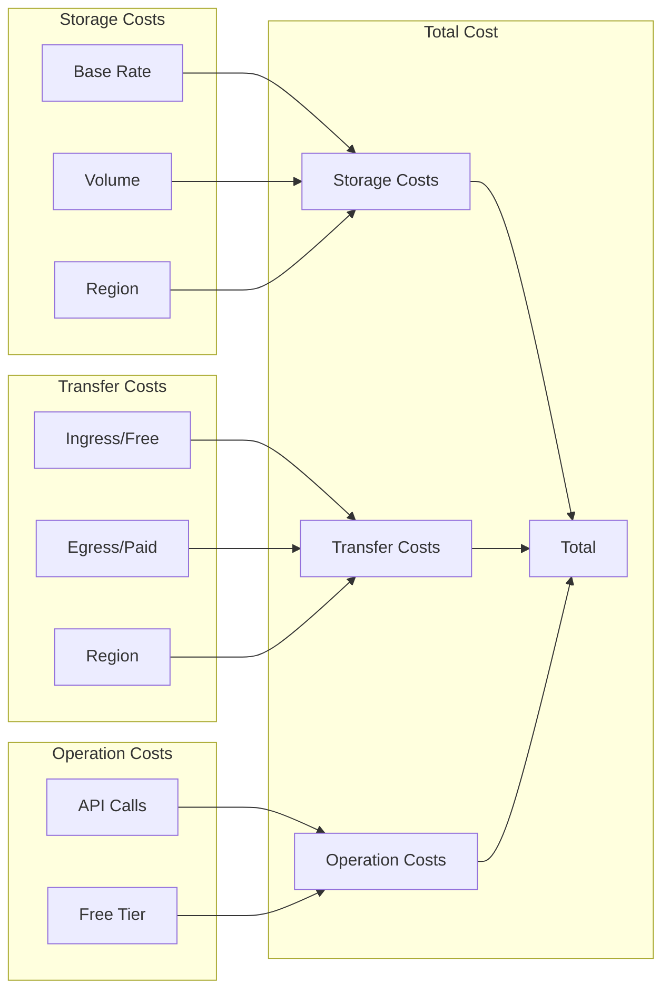
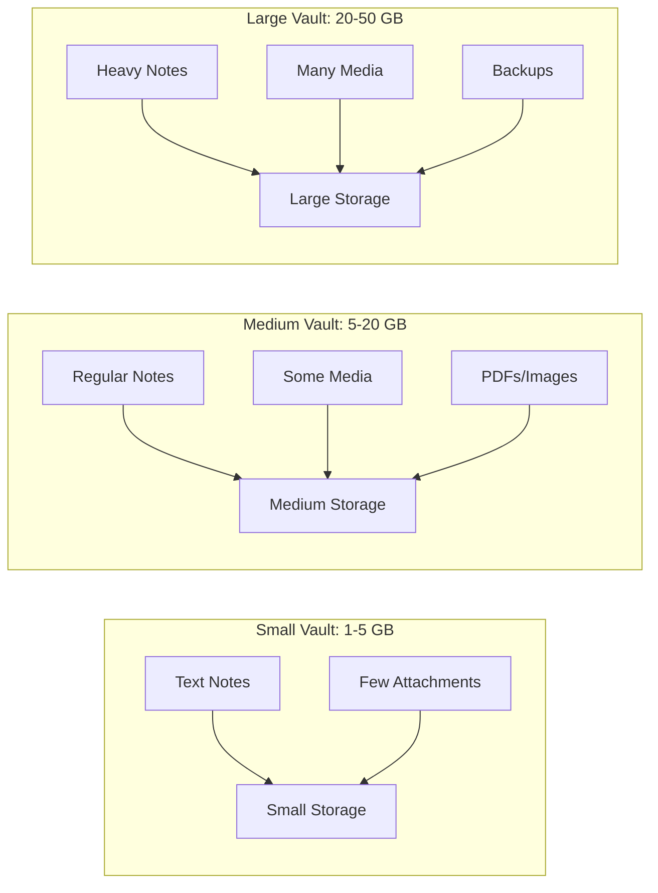
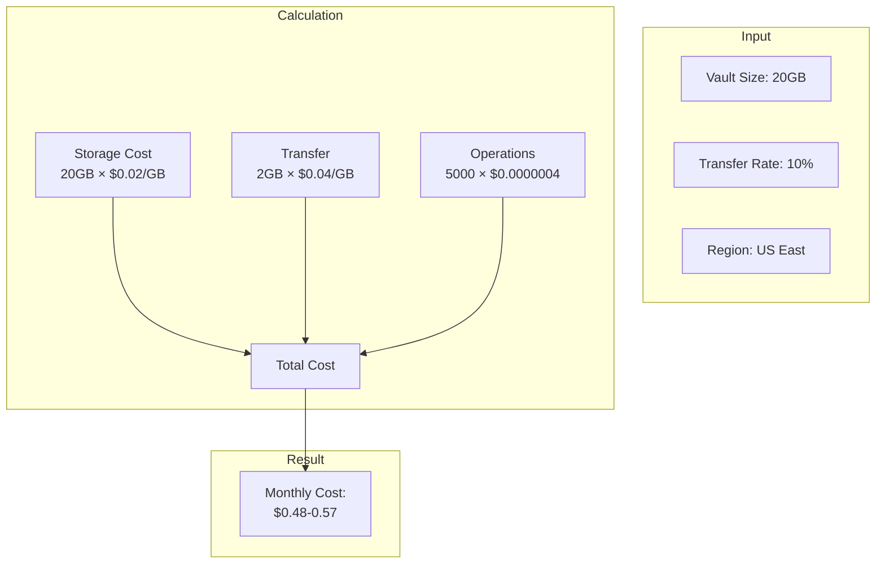

# Cost Analysis

This document provides a detailed breakdown of cloud storage costs when using CloudSync. For a comparison with Obsidian Sync, see [CloudSync vs Obsidian Sync](comparison.md).

## Cost Structure Overview

## Cost Components

### 1. Storage Costs
- Monthly fee per GB stored
- Range: $0.02-0.05 per GB/month
- Varies by:
  - Region
  - Storage tier
  - Provider

### 2. Data Transfer
- **Ingress (Upload)**
  - Generally free
  - No provider charges
- **Egress (Download)**
  - Charged per GB
  - First portion often free:
    - Azure: 5 GB/month
    - AWS: 1 GB/month
    - GCP: 1 GB/month

### 3. API Operations
- Read/write/list operations
- Usually negligible
- Free tier limits:
  - Azure: 50,000 operations
  - AWS: 2,000 PUT/LIST, 20,000 GET
  - GCP: 50,000 operations

## Vault Size Categories

## Monthly Cost Breakdown (USD)

### Small Vault (5 GB)

| Component      | Azure          | AWS            | GCP            |
|---------------|----------------|----------------|----------------|
| Storage       | $0.10         | $0.12         | $0.11         |
| Transfer*     | Free**        | Free***       | Free****      |
| Operations    | Free          | Free          | Free          |
| **Total**     | **$0.10**     | **$0.12**     | **$0.11**     |

### Medium Vault (20 GB)

| Component      | Azure          | AWS            | GCP            |
|---------------|----------------|----------------|----------------|
| Storage       | $0.40         | $0.48         | $0.44         |
| Transfer*     | $0.08         | $0.09         | $0.08         |
| Operations    | Free          | Free          | Free          |
| **Total**     | **$0.48**     | **$0.57**     | **$0.52**     |

### Large Vault (50 GB)

| Component      | Azure          | AWS            | GCP            |
|---------------|----------------|----------------|----------------|
| Storage       | $1.00         | $1.20         | $1.10         |
| Transfer*     | $0.20         | $0.23         | $0.20         |
| Operations    | $0.01         | $0.01         | $0.01         |
| **Total**     | **$1.21**     | **$1.44**     | **$1.31**     |

\* Transfer costs assume 10% of vault size transferred monthly
\** Azure: First 5 GB/month free
\*** AWS: First 1 GB/month free
\**** GCP: First 1 GB/month free

## Cost Calculation Example

## Cost Optimization

### 1. Region Selection
- Choose nearest region for performance
- Compare regional pricing
- Consider data transfer costs

### 2. Transfer Optimization
- Full file transfers (no deltas)
- Rename = Delete + Create
- Consider sync frequency

### 3. Free Tier Usage
- Leverage free transfer allowances
- Use free operation quotas
- Stay within limits when possible

### 4. Sync Settings
- Adjust automatic sync interval
- Balance frequency vs. costs
- Consider manual sync for large files

## Current Pricing Links

- [Azure Blob Storage](https://azure.microsoft.com/pricing/details/storage/blobs/)
- [AWS S3](https://aws.amazon.com/s3/pricing/)
- [Google Cloud Storage](https://cloud.google.com/storage/pricing)

*Note: Prices current as of 2024. Check provider pricing pages for updates.*
