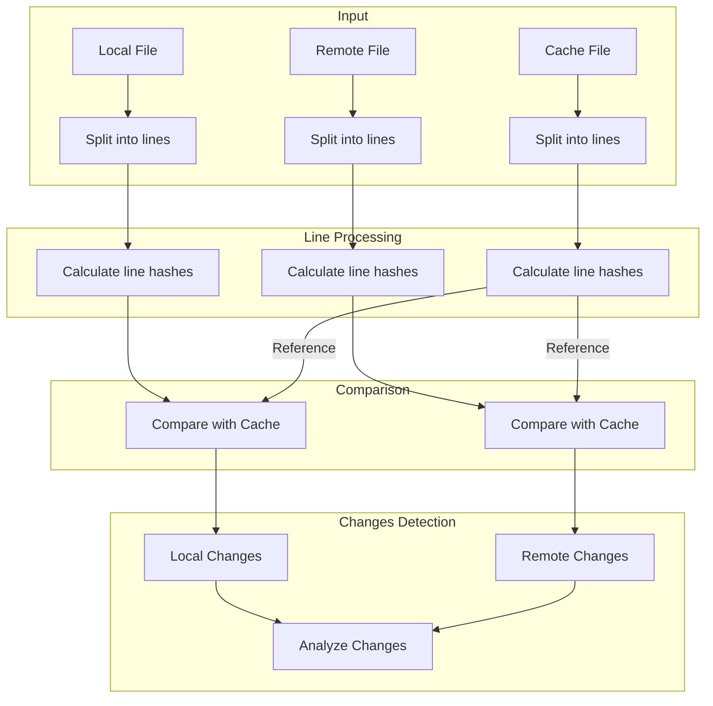
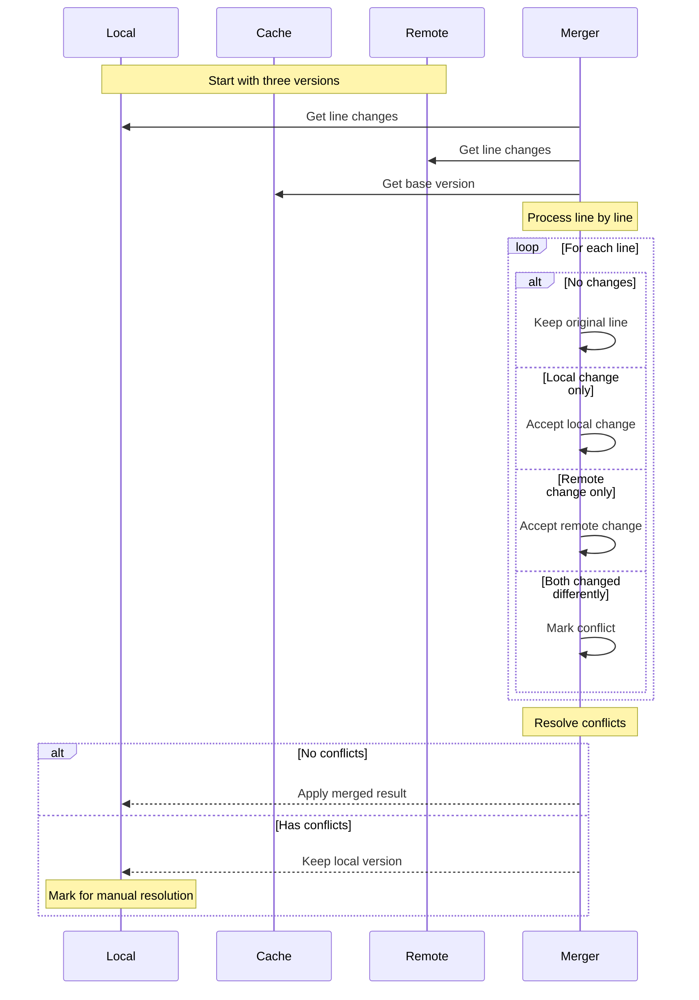

# Diff Match and Merge Process

The following diagrams illustrate how CloudSync performs line-level file comparison and merging.

## Line-Level Diff Process



## Line-Level Merge Process



## Example Merge Scenarios

### Scenario 1: Non-conflicting Changes
```
Base (Cache):
Line 1: Hello
Line 2: World
Line 3: !

Local:
Line 1: Hello there
Line 2: World
Line 3: !

Remote:
Line 1: Hello
Line 2: Beautiful World
Line 3: !

Result:
Line 1: Hello there
Line 2: Beautiful World
Line 3: !
```

### Scenario 2: Conflicting Changes
```
Base (Cache):
Line 1: Hello
Line 2: World
Line 3: !

Local:
Line 1: Hello there
Line 2: World
Line 3: !

Remote:
Line 1: Hi there
Line 2: World
Line 3: !

Result (Conflict):
Line 1: -Hello there
Line 2: +Hi there
Line 3: World
Line 4: !
```

## Key Features

1. **Three-Way Comparison**
   - Uses cached version as base reference
   - Compares both local and remote changes against base
   - Enables accurate conflict detection

2. **Line-Level Granularity**
   - Processes files line by line
   - Maintains line order and structure
   - Preserves unmodified lines

3. **Smart Merge Resolution**
   - Automatically merges non-conflicting changes
   - Identifies and marks conflicting changes
   - Preserves local changes in conflict cases

4. **Change Detection**
   - Identifies line additions
   - Detects line deletions
   - Recognizes line modifications

5. **Conflict Handling**
   - Marks conflicts clearly in the output
   - Preserves both versions in conflict cases
   - Enables manual conflict resolution
