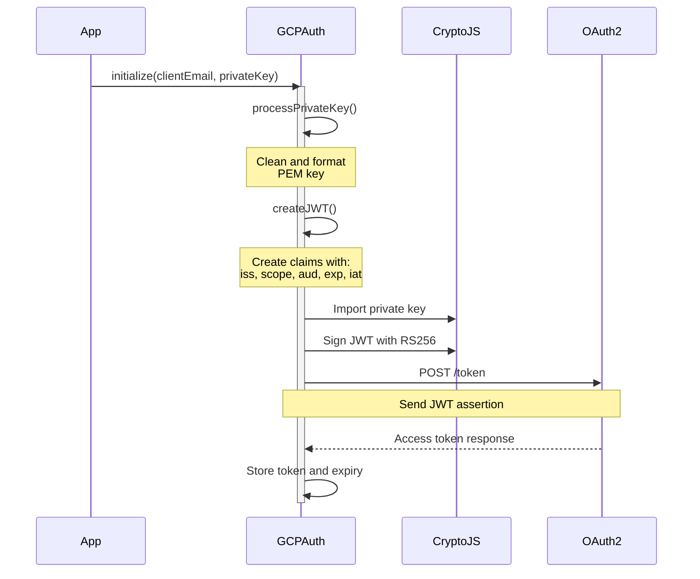
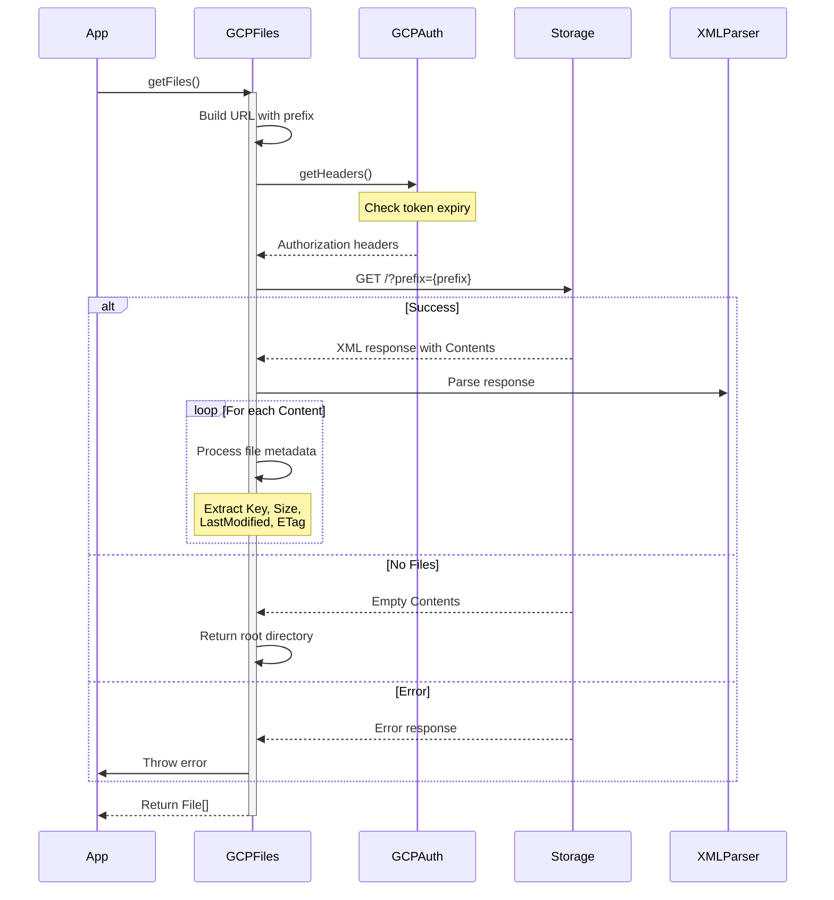
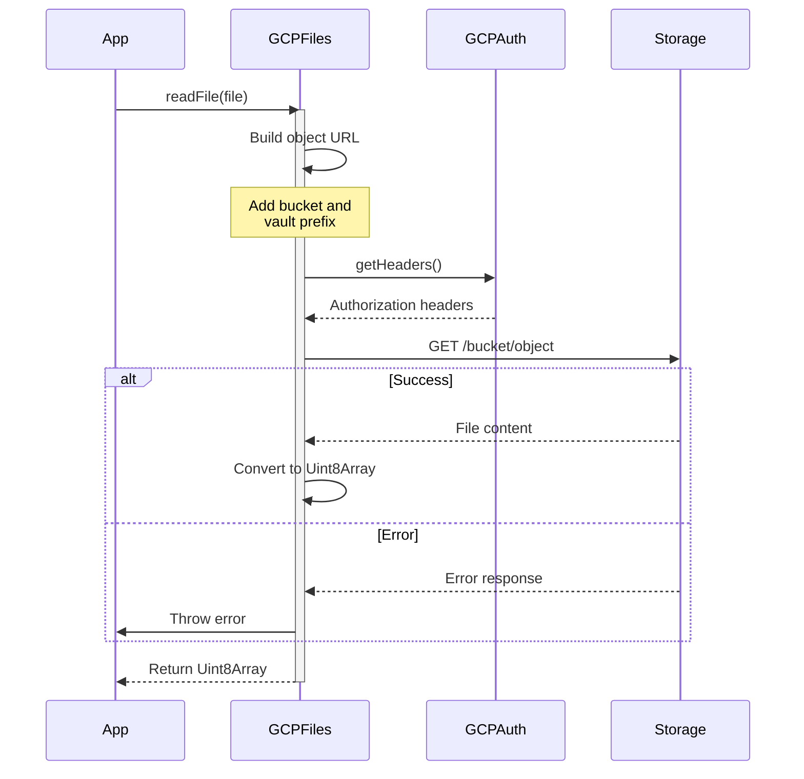
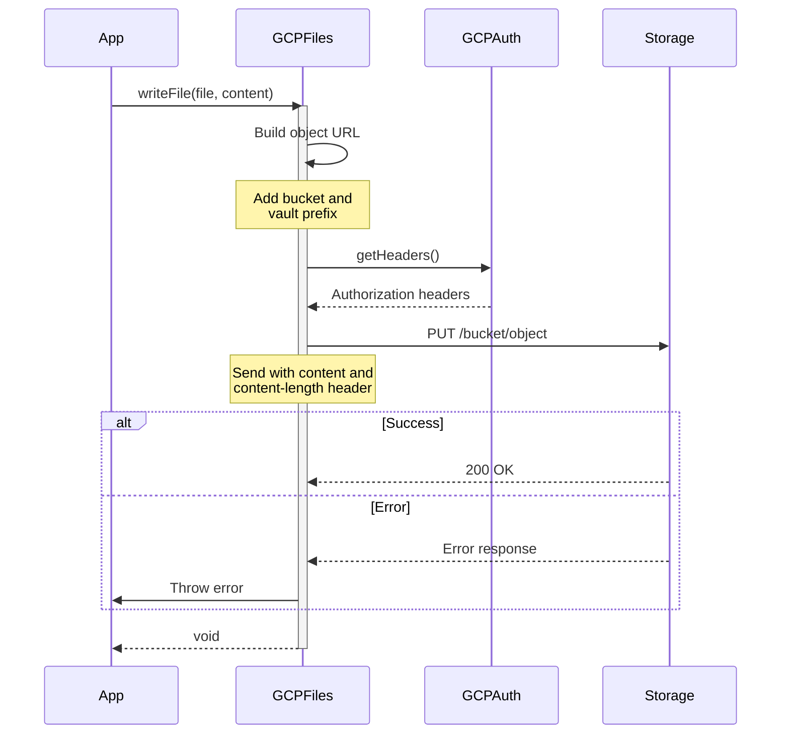
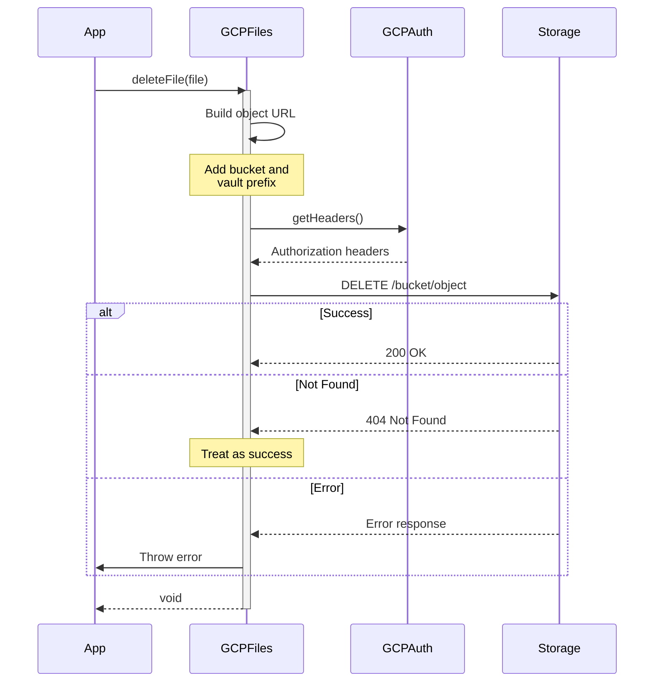

# GCP API Operations Flow

## GCP Authentication Flow

## List Files Operation

## Read File Operation

## Write File Operation

## Delete File Operation

## Key Components

1. **Authentication**
   - JWT creation with RS256 signing
   - OAuth2 token exchange
   - Automatic token refresh
   - Private key processing

2. **URL Construction**
   - Object URL formatting
   - Prefix handling
   - Bucket path management
   - Query parameter encoding

3. **File Operations**
   - List: XML/JSON response parsing
   - Read: Direct object download
   - Write: Object upload with headers
   - Delete: Object removal with 404 handling

4. **Error Handling**
   - Token expiration checks
   - HTTP status validation
   - XML error parsing
   - Retry mechanism

5. **Path Management**
   - Vault prefix handling
   - Remote path normalization
   - Directory markers
   - Root directory handling
