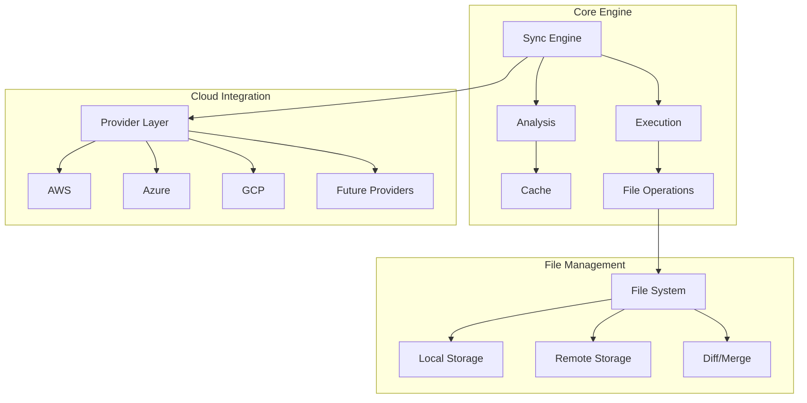

# Architecture Overview

This document provides an overview of CloudSync's architecture and serves as a guide to the technical documentation.

## Overview

CloudSync is an Obsidian plugin that enables vault synchronization with multiple cloud storage providers (AWS S3, Azure Blob Storage, Google Cloud Storage). The plugin implements a robust synchronization engine with conflict detection and resolution capabilities.

## Core Architecture Documents

1. [Classes](/classes.md) - Class diagrams and relationships
   - Core sync component structure
   - Cloud provider implementations
   - File management system

2. [Internals](/internals.md) - Internal architecture and processes
   - System components
   - Initialization flow
   - Synchronization process
   - Cache management
   - Automatic sync features

3. [Sync Flow](/syncFlow.md) - Detailed synchronization process
   - Component interactions
   - State management
   - Error handling
   - Progress tracking

4. [Diff Merge](/diffMerge.md) - File comparison and merging
   - Line-level diff process
   - Merge scenarios
   - Conflict resolution
   - Three-way comparison

## Cloud Provider Implementations

1. [AWS Fetch](/awsFetch.md) - AWS S3 integration
   - AWS4-HMAC-SHA256 signing
   - S3 API operations
   - Error handling
   - Path management

2. [Azure Fetch](/azureFetch.md) - Azure Blob Storage integration
   - SAS token authentication
   - Blob operations
   - Container management
   - Error handling

3. [GCP Fetch](/gcpFetch.md) - Google Cloud Storage integration
   - OAuth2/JWT authentication
   - Object operations
   - Token management
   - Error handling

## Additional Documentation

1. [Comparison](/comparison.md) - Cloud provider comparison
   - Feature comparison
   - Implementation differences
   - Provider-specific limitations

2. [Cost](/cost.md) - Cost considerations
   - Storage costs
   - Operation costs
   - Bandwidth usage

## Key Architectural Features

## Implementation Patterns

1. **Abstraction Layer**
   - AbstractManager base class
   - Provider-specific implementations
   - Unified file operations interface

2. **Sync Engine**
   - Three-way comparison
   - State-based analysis
   - Atomic operations
   - Transaction-like execution

3. **Cache System**
   - File state tracking
   - MD5 hash comparison
   - Last sync timestamps
   - Conflict detection

4. **Error Handling**
   - Provider-specific error mapping
   - Retry mechanisms
   - Rollback capabilities
   - Detailed logging

## Development Guidelines

1. **Adding New Features**
   - Extend AbstractManager for new providers
   - Implement provider-specific authentication
   - Add necessary path handling
   - Update provider tests

2. **Modifying Sync Logic**
   - Update SyncAnalyzer for new scenarios
   - Modify SyncExecutor for new operations
   - Update cache handling if needed
   - Add test cases

3. **Error Handling**
   - Use provider-specific error classes
   - Implement proper error mapping
   - Add retry logic where appropriate
   - Include detailed logging

4. **Testing**
   - Unit tests for new components
   - Integration tests for providers
   - End-to-end sync testing
   - Error scenario testing

## Future Considerations

1. **Extensibility**
   - New cloud provider support
   - Additional sync strategies
   - Enhanced conflict resolution
   - Performance optimizations

2. **Maintenance**
   - Provider API updates
   - Security improvements
   - Performance monitoring
   - Error tracking

## Related Resources

- [Security Documentation](/security.md)
- [Installation Guide](/install.md)
- Provider Setup Guides:
  - [AWS Setup](/aws.md)
  - [Azure Setup](/azure.md)
  - [GCP Setup](/gcp.md)
