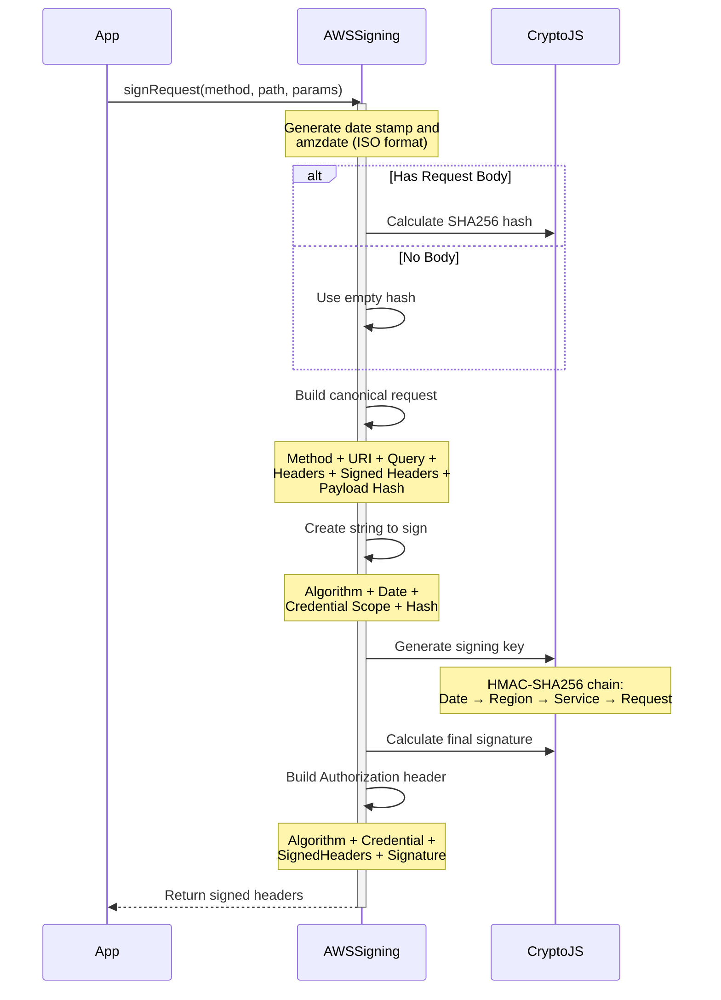
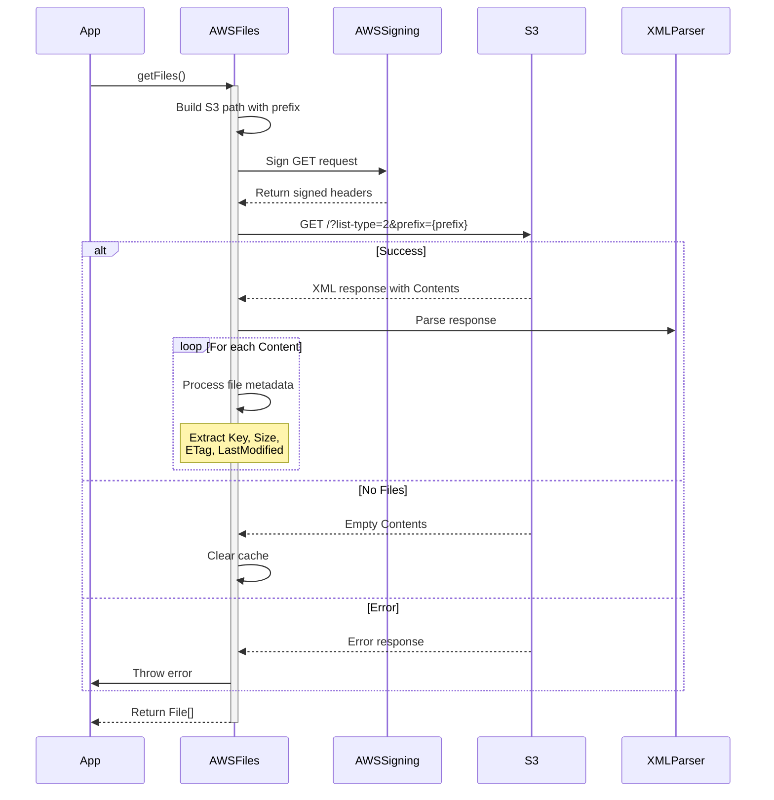
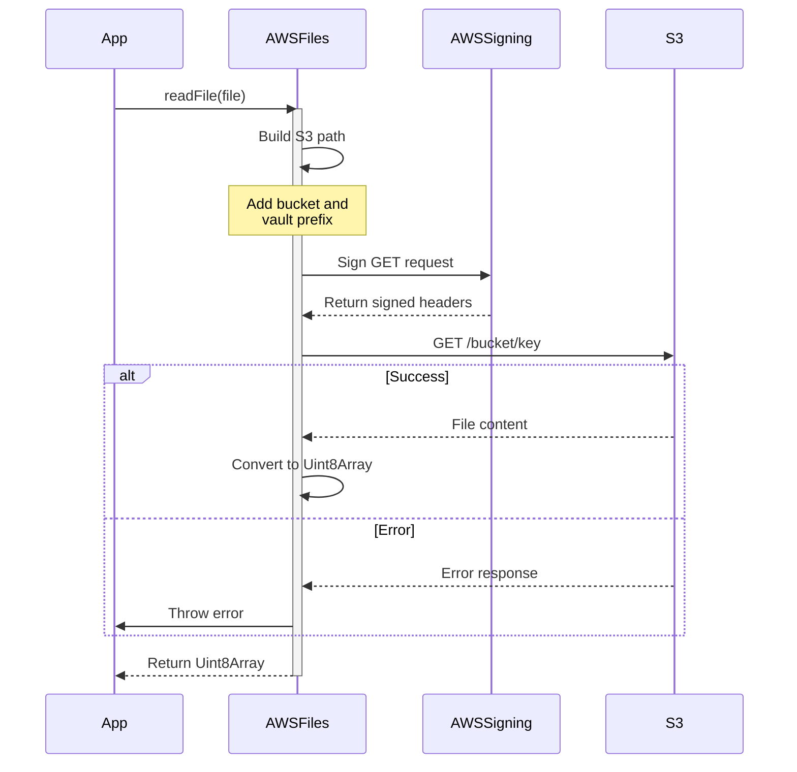
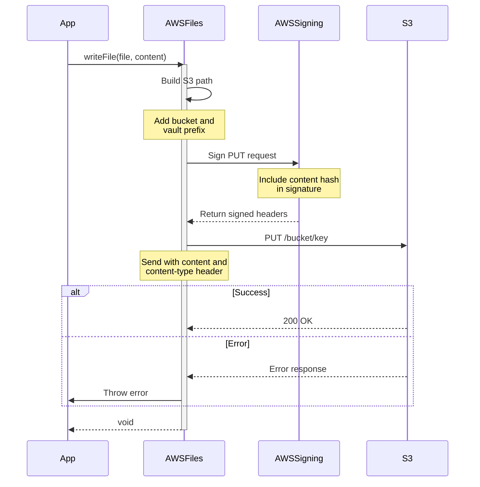
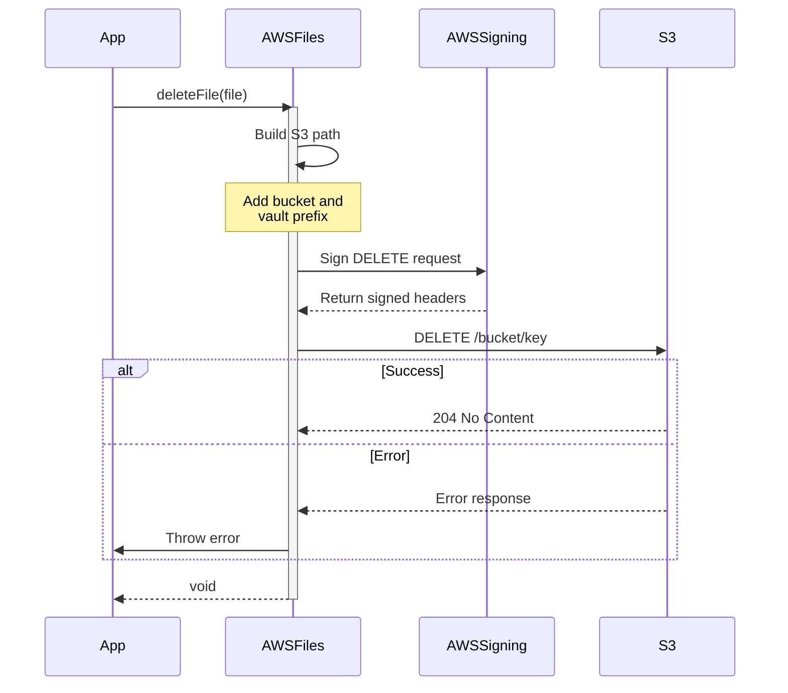

# AWS API Operations Flow

## AWS Request Signing Process

## List Files Operation

## Read File Operation

## Write File Operation

## Delete File Operation

## Key Components

1. **AWS Request Signing (AWS4-HMAC-SHA256)**
   - Canonical request construction
   - Credential scope building
   - HMAC-SHA256 key derivation
   - Authorization header generation

2. **URL Construction**
   - Proper path encoding
   - Query parameter handling
   - Bucket and key formatting
   - Vault prefix management

3. **File Operations**
   - List: XML parsing of bucket contents
   - Read: Direct object GET
   - Write: PUT with content headers
   - Delete: Object removal

4. **Error Handling**
   - HTTP status code validation
   - XML error parsing
   - Retry mechanism
   - Cache invalidation

5. **Path Management**
   - URI encoding
   - Vault prefix handling
   - Remote path normalization
   - Directory markers
