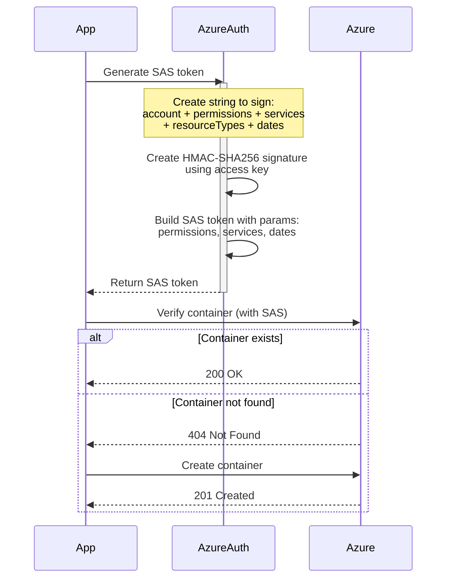
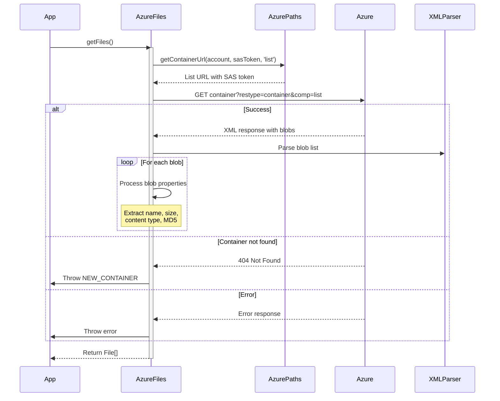
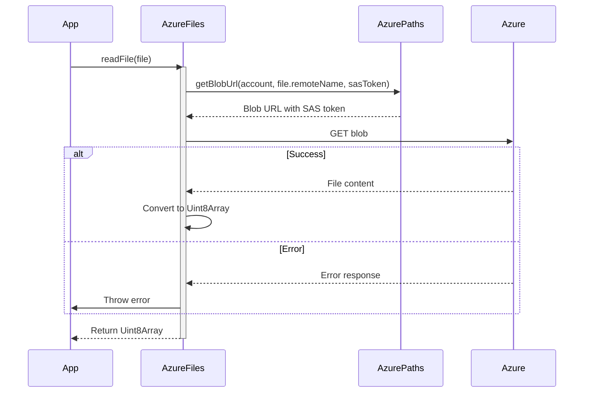
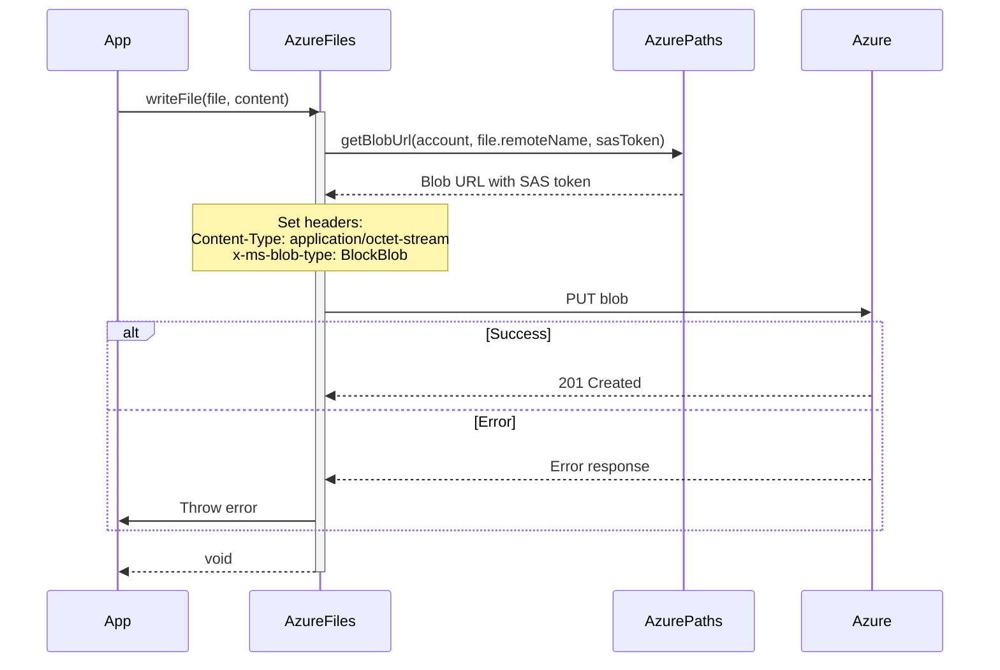
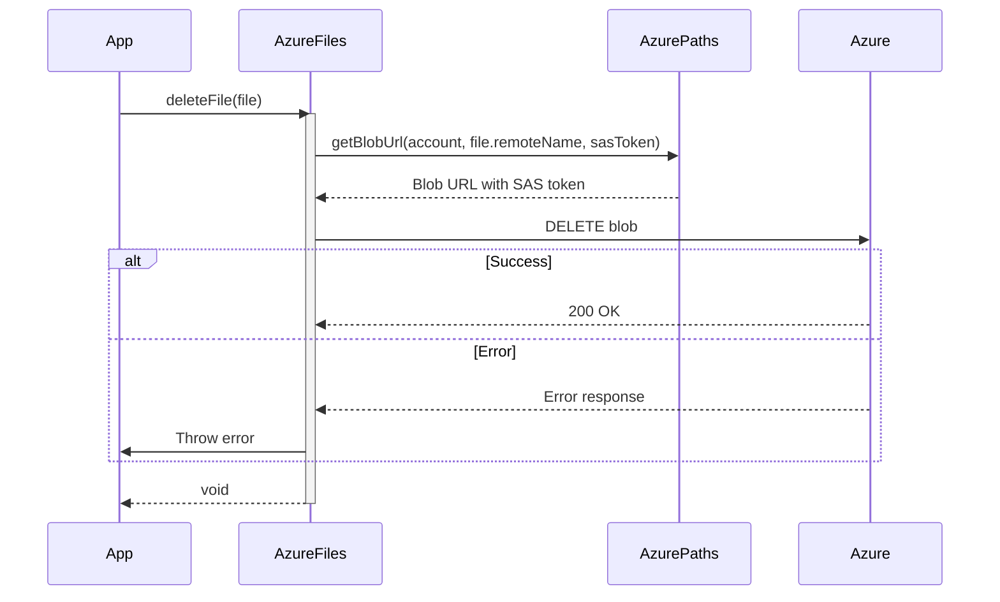

# Azure API Operations Flow

## Authentication Flow

## List Files Operation

## Read File Operation

## Write File Operation

## Delete File Operation

## Key Components

1. **Authentication**
   - Uses SAS (Shared Access Signature) tokens
   - Tokens include permissions and expiry time
   - HMAC-SHA256 signing of token parameters

2. **URL Construction**
   - Container URLs for list operations
   - Blob URLs for individual file operations
   - Proper encoding of container and blob names
   - SAS token appended to all URLs

3. **File Operations**
   - List: XML parsing of container contents
   - Read: Direct blob download
   - Write: BlockBlob upload with content type
   - Delete: Simple blob deletion

4. **Error Handling**
   - Container existence check
   - Automatic container creation
   - HTTP status code validation
   - Detailed error messages
   - CORS validation

5. **Path Management**
   - Path normalization
   - Cloud path encoding
   - Remote name handling
   - Container name encoding
