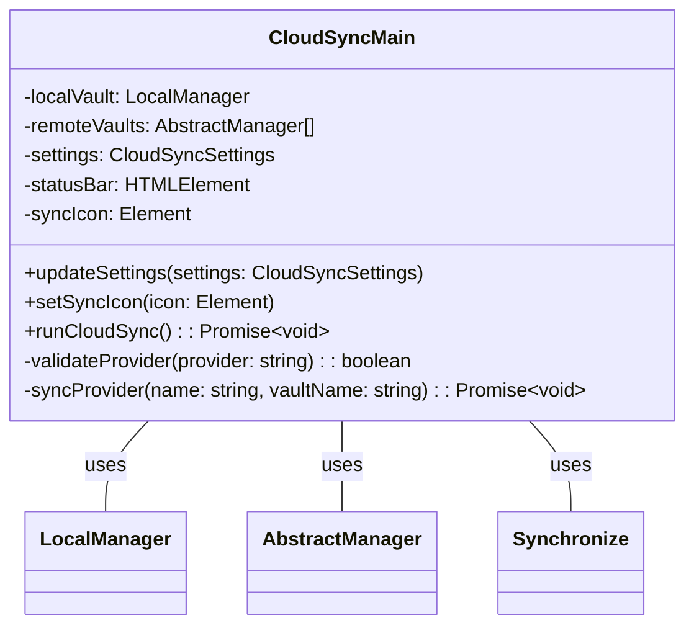
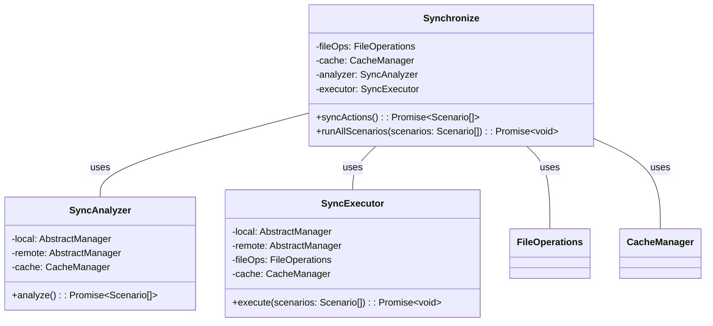
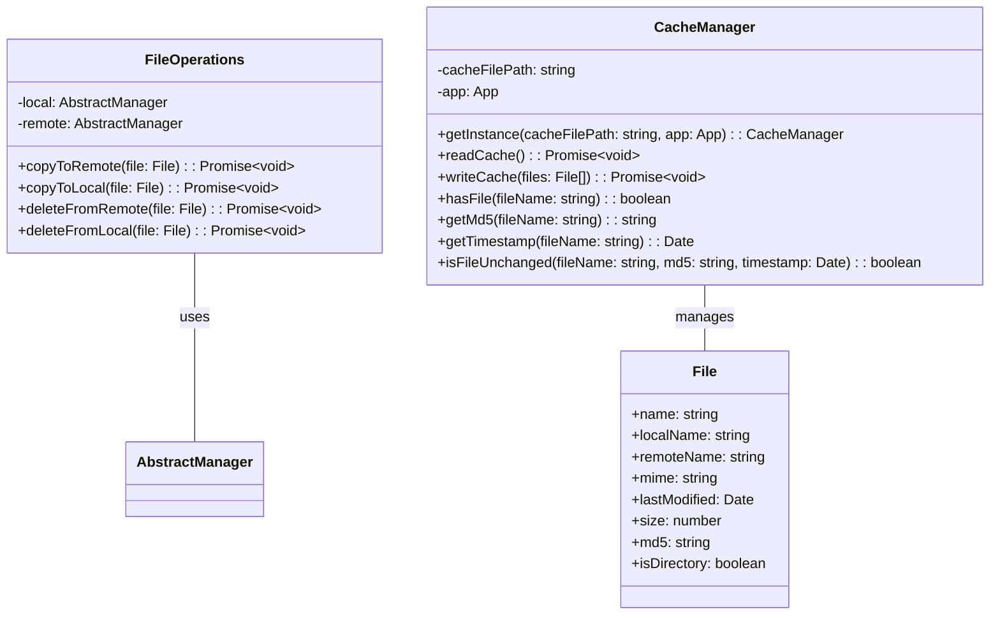
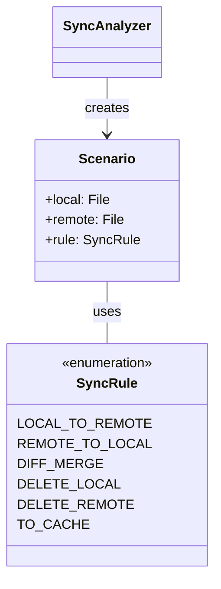
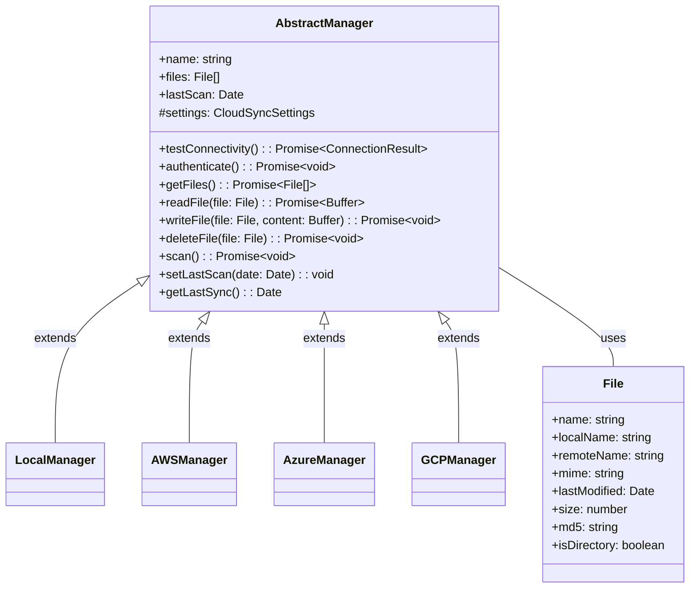
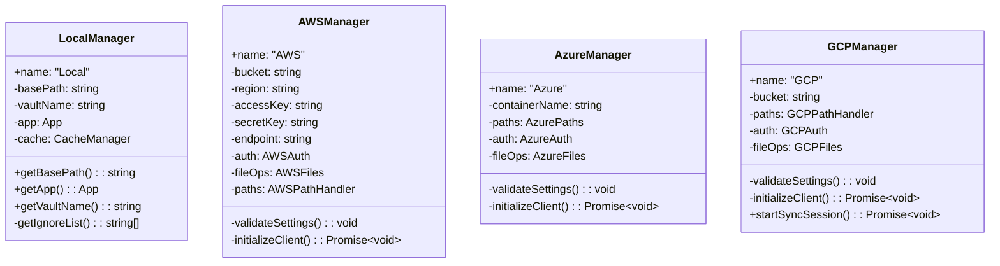

# Class Diagrams

## Core Components

### Main Plugin Structure

### Synchronization Components

### File and Cache Management

### Sync Rules and Scenarios

## Cloud Provider Architecture

### Provider Implementations

The diagrams above illustrate the key components and relationships in the CloudSync plugin:

1. **Main Plugin Structure**: Shows the entry point and core plugin setup through CloudSyncMain.

2. **Synchronization Components**: Details the synchronization process through Synchronize, SyncAnalyzer, and SyncExecutor classes.

3. **File and Cache Management**: Shows how files are handled and cached in the system.

4. **Sync Rules and Scenarios**: Illustrates the decision-making process for file synchronization.

5. **Cloud Provider Architecture**: Shows the abstract manager and file interfaces.

6. **Provider Implementations**: Details how different cloud providers implement the abstract interfaces.

Key features of the architecture:
- Modular design with clear separation of concerns
- Extensible provider system through AbstractManager
- Robust file handling with caching support
- Flexible synchronization rules
- Error handling and logging throughout the system
