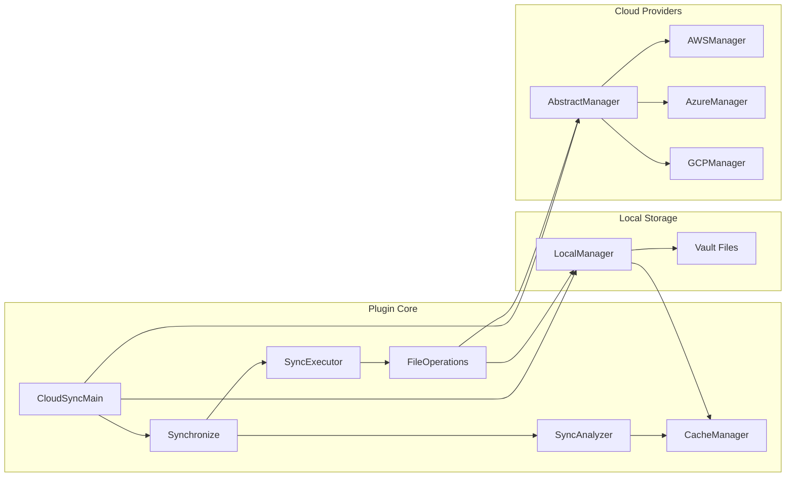
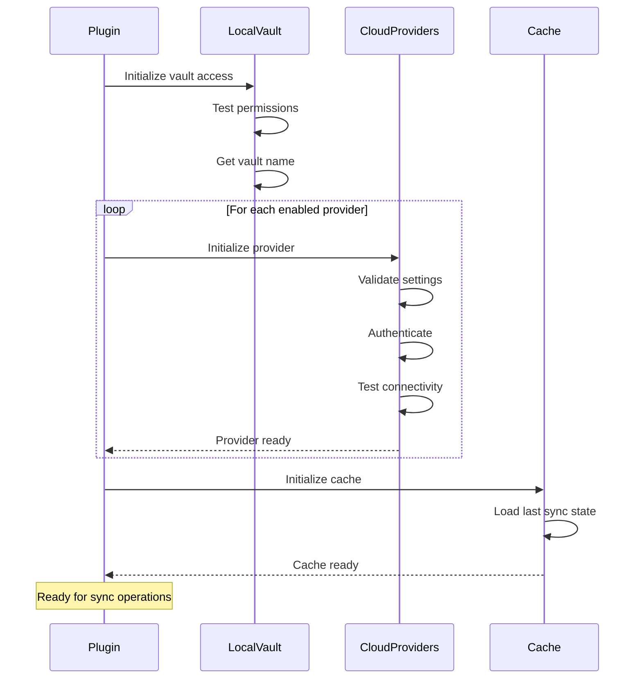
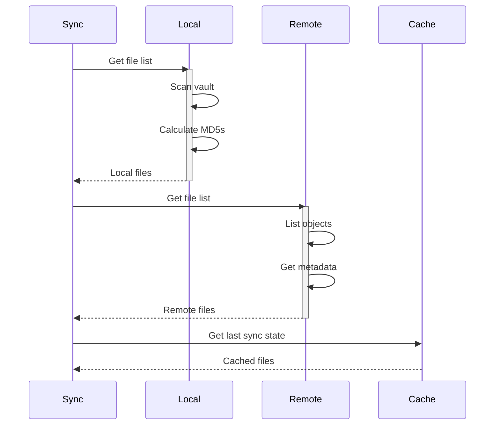
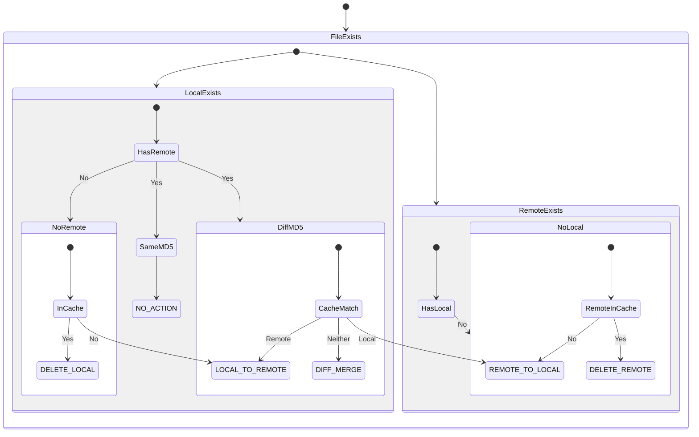
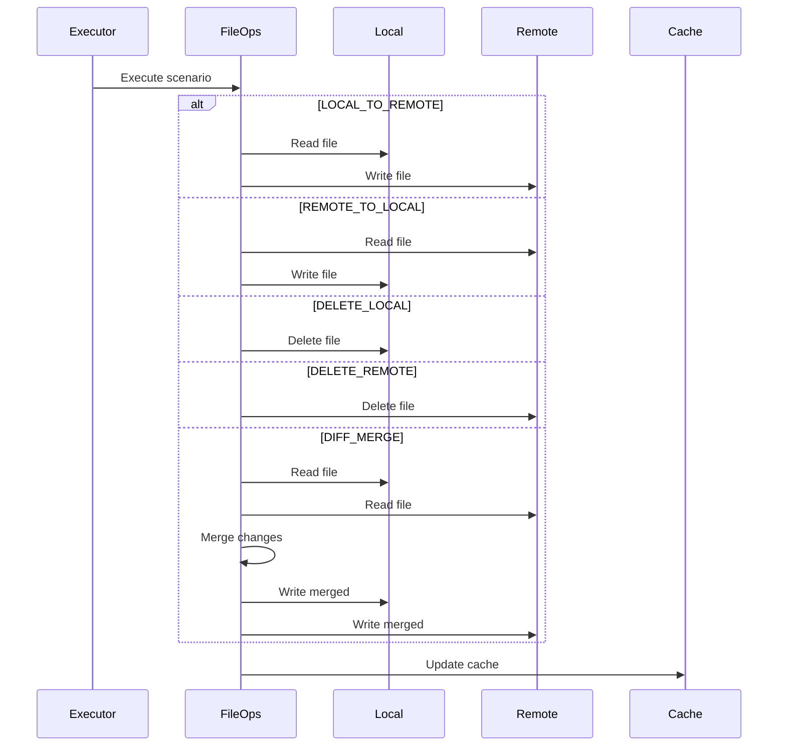
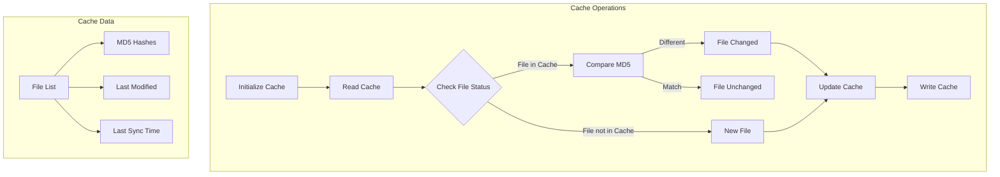

# Internal Architecture

> For a complete overview of CloudSync's technical architecture and implementation details, see [Architecture Documentation](doc/architecture.md).

## System Components

## Initialization Flow

## Synchronization Process

### 1. File Discovery Phase

### 2. Sync Analysis

### 3. File Operations

## Cache Management

## Key Features

1. **Multi-Provider Support**
   - Abstract manager interface
   - Provider-specific implementations
   - Unified file operations

2. **Robust Sync Logic**
   - Three-way comparison (local/remote/cache)
   - Conflict detection
   - Automatic conflict resolution
   - Line-level diff and merge

3. **Cache Management**
   - File state tracking
   - MD5 hash comparison
   - Timestamp management
   - Sync history

4. **Error Handling**
   - Connection retry logic
   - Operation timeout handling
   - Rollback capabilities
   - Detailed logging

5. **Path Management**
   - Cross-platform path normalization
   - Cloud path encoding
   - Vault prefix handling
   - Directory markers

## Automatic Synchronization

The plugin supports automatic synchronization with configurable intervals:

1. **Timer Management**
   - Configurable sync interval
   - Automatic reset after sync
   - Manual sync override

2. **State Tracking**
   - Active sync detection
   - Last sync timestamp
   - Error state handling

3. **Resource Optimization**
   - Throttled operations
   - Batch processing
   - Cache utilization
