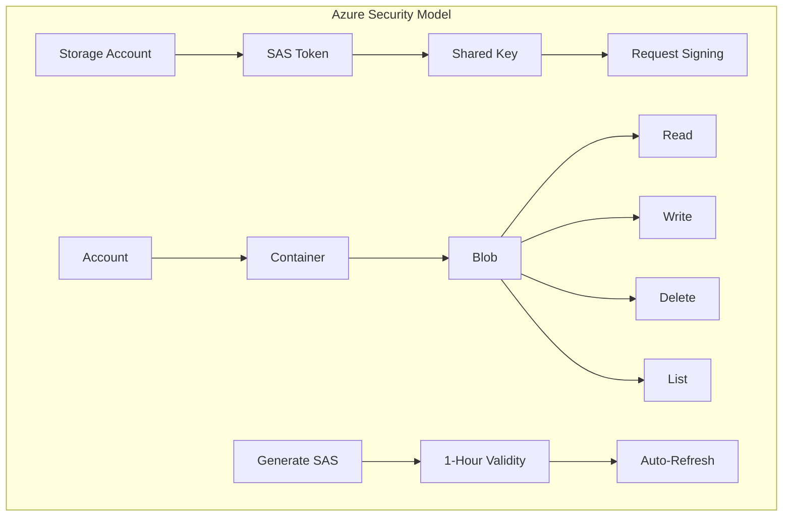
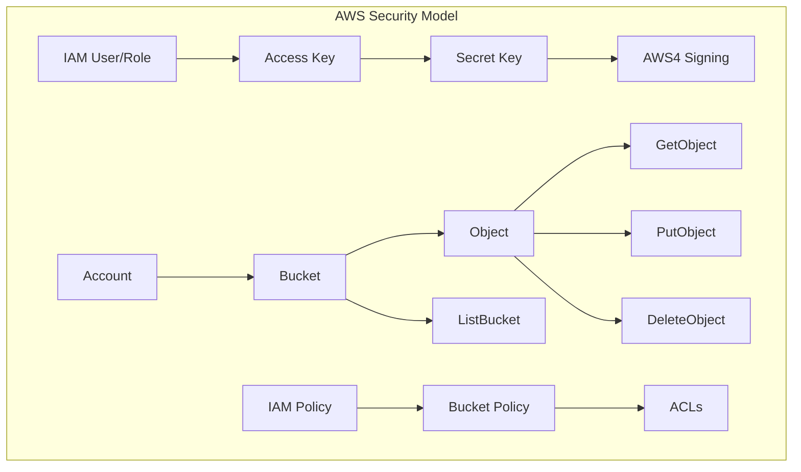
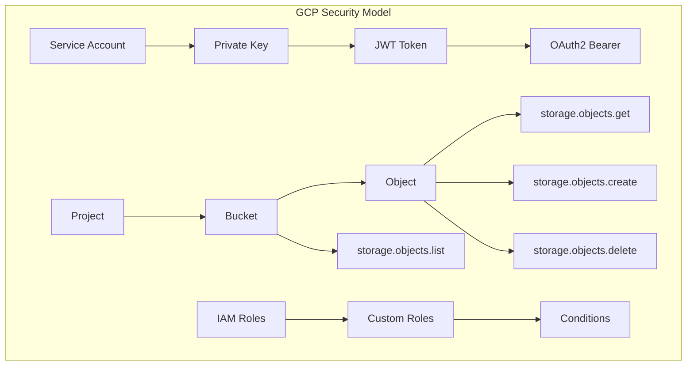

# Security Model

CloudSync implements provider-specific security models optimized for each cloud storage service.

## Azure Blob Storage Security



### Azure Authentication
- **Storage Account**: Root access point
- **SAS Token**: Time-limited access signature
- **Shared Key**: Cryptographic authentication
- **Request Signing**: HMAC-SHA256 with key

### Azure Access Control
- **Account Level**: Global permissions
- **Container Level**: Vault isolation
- **Blob Level**: File-specific access
- **Operations**: Read, Write, Delete, List

## AWS S3 Security



### AWS Authentication
- **IAM User/Role**: Identity management
- **Access Key**: Public identifier
- **Secret Key**: Private signing key
- **AWS4 Signing**: SHA-256 HMAC chain

### AWS Access Control
- **Account Level**: IAM policies
- **Bucket Level**: Bucket policies
- **Object Level**: ACLs
- **Operations**: GetObject, PutObject, DeleteObject, ListBucket

## Google Cloud Storage Security



### GCP Authentication
- **Service Account**: Robot account identity
- **Private Key**: JWT signing key
- **JWT Token**: Self-signed assertion
- **OAuth2**: Bearer token authentication

### GCP Access Control
- **Project Level**: IAM roles
- **Bucket Level**: ACLs
- **Object Level**: Object ACLs
- **Operations**: get, create, delete, list

## Security Implementation

### Azure Implementation
```typescript
interface AzureAuth {
    accountName: string;
    accountKey: string;
    sasToken: string;
    containerName: string;
}

// SAS Token Generation
const generateSasToken = (auth: AzureAuth): string => {
    const now = new Date();
    const expiry = new Date(now.getTime() + 3600000); // 1 hour

    return generateAccountSasToken({
        accountName: auth.accountName,
        accountKey: auth.accountKey,
        permissions: 'rwdl',
        expiry: expiry,
        services: 'b',
        resourceTypes: 'co'
    });
}
```

### AWS Implementation
```typescript
interface AwsAuth {
    accessKeyId: string;
    secretAccessKey: string;
    region: string;
    bucket: string;
}

// AWS4 Request Signing
const signRequest = (auth: AwsAuth, request: Request): string => {
    return aws4.sign({
        host: `${auth.bucket}.s3.${auth.region}.amazonaws.com`,
        method: request.method,
        path: request.path,
        headers: request.headers,
        body: request.body,
        service: 's3',
        region: auth.region
    }, {
        accessKeyId: auth.accessKeyId,
        secretAccessKey: auth.secretAccessKey
    });
}
```

### GCP Implementation
```typescript
interface GcpAuth {
    projectId: string;
    clientEmail: string;
    privateKey: string;
    bucket: string;
}

// OAuth2 Token Generation
const generateToken = async (auth: GcpAuth): Promise<string> => {
    const jwt = new JWT({
        email: auth.clientEmail,
        key: auth.privateKey,
        scopes: ['https://www.googleapis.com/auth/devstorage.read_write']
    });

    const token = await jwt.getAccessToken();
    return token.token;
}
```
