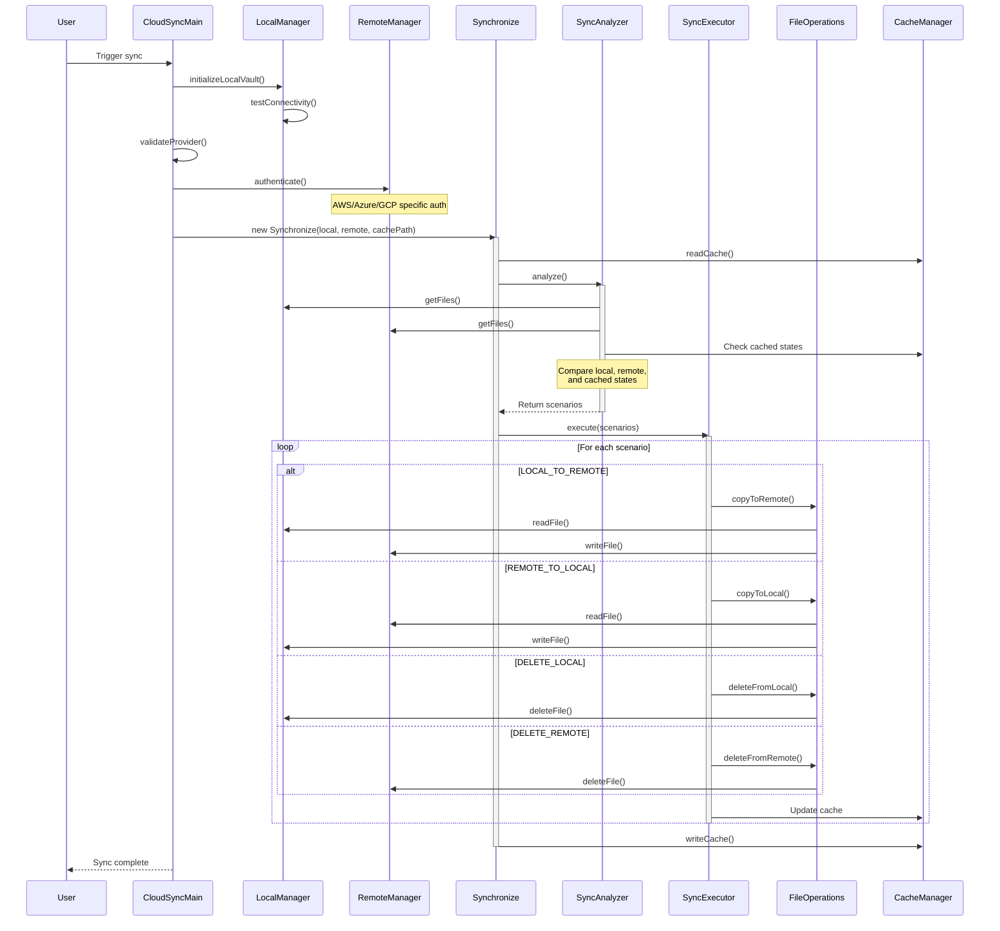

# Synchronization Flow

The following sequence diagram illustrates the detailed flow of a synchronization operation in the CloudSync plugin.

## Flow Description

1. **Initialization Phase**
   - User triggers synchronization
   - CloudSyncMain initializes the local vault
   - Validates provider configuration
   - Authenticates with the remote provider (AWS/Azure/GCP)

2. **Analysis Phase**
   - Creates new Synchronize instance with local and remote managers
   - Reads the existing cache state
   - SyncAnalyzer scans both local and remote files
   - Compares file states (local vs remote vs cache)
   - Generates synchronization scenarios based on differences

3. **Execution Phase**
   - SyncExecutor processes each scenario
   - Performs appropriate file operations based on sync rules:
     - LOCAL_TO_REMOTE: Copy local file to remote
     - REMOTE_TO_LOCAL: Copy remote file to local
     - DELETE_LOCAL: Remove local file
     - DELETE_REMOTE: Remove remote file
   - Updates cache after each operation

4. **Finalization**
   - Writes final state to cache
   - Reports completion to user

## Key Features

- **Bidirectional Sync**: Supports both upload and download operations
- **Conflict Detection**: Uses cached state to detect conflicts
- **Atomic Operations**: Each file operation is handled independently
- **Error Handling**: Each phase includes error handling and rollback capabilities
- **State Management**: Maintains cache state for future synchronizations
