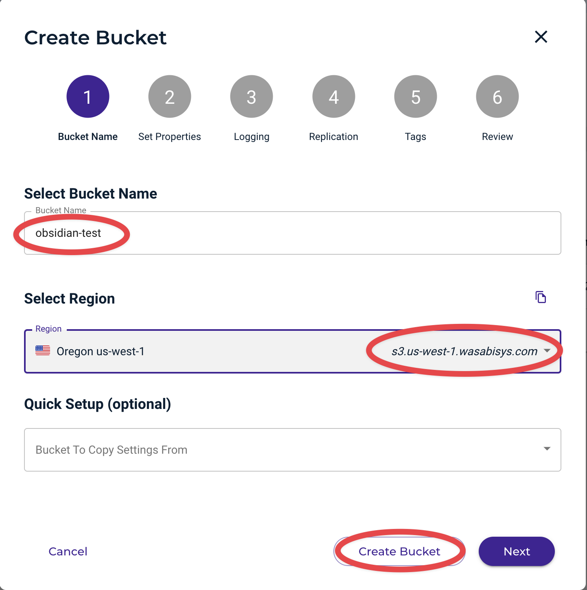
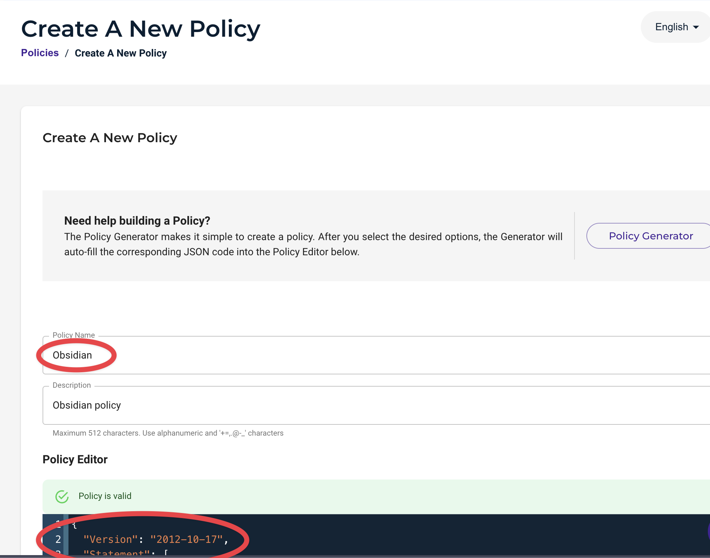
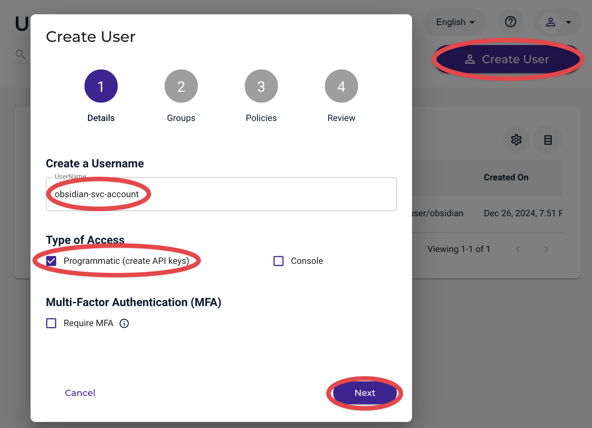
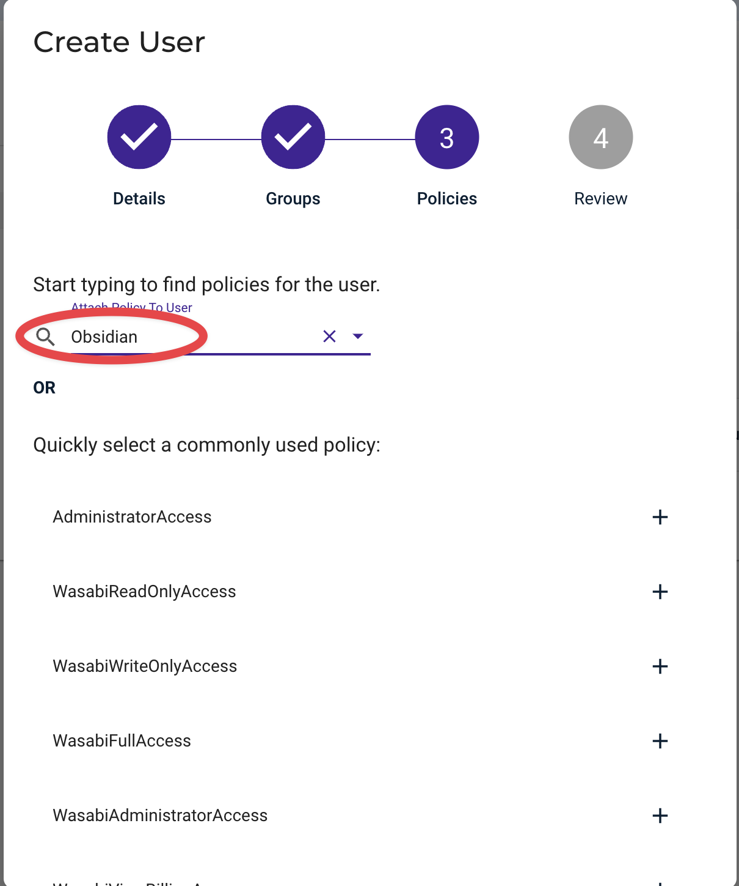
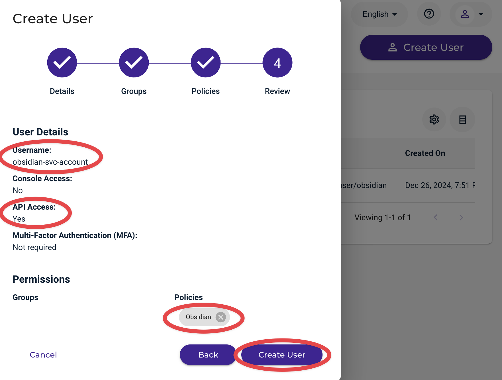
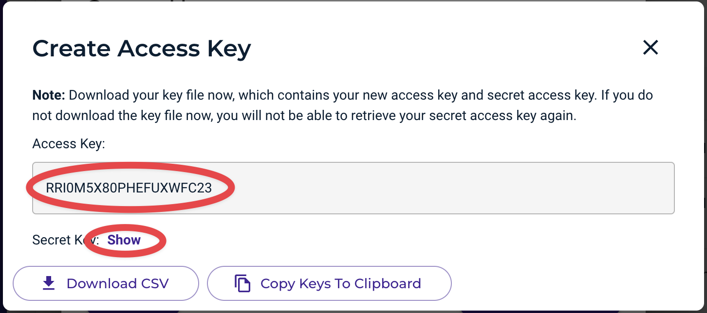
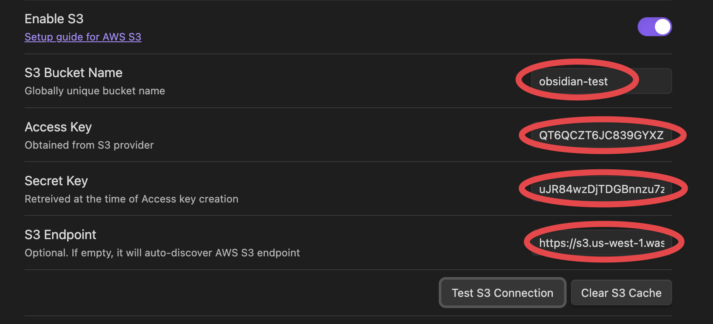

# Wasabi Hot Cloud Storage Setup

## Sign in to Wasabi Management Console
   - Make sure you have Wasabi account

## Create an S3 bucket
   - Navigate to Buckets in the Console
   - Click "Create Bucket"
   - Choose a unique bucket name (<obsidian-test>)
   - Choose a region for your bucket and remember the endpoint (<s3.us-west-1.wasabisys.com>)
   - Click "Create bucket" at the bottom right


## Create an access policy
   - Navigate to Policies in the Console
   - click "Create Policy"
   - Type the name of custom policy (<obsidian>)
   - Add the following policy (replace <obsidian-test> with name of your bucket )
   - Click "Create Policy" at the bottom right"
```json
{
  "Version": "2012-10-17",
  "Statement": [
    {
      "Effect": "Allow",
      "Action": [
        "s3:PutObject",
        "s3:GetObject",
        "s3:DeleteObject",
        "s3:ListBucket"
      ],
      "Resource": [
        "arn:aws:s3:::obsidian-test",
        "arn:aws:s3:::obsidian-test/*"
      ]
    }
  ]
}
```


## Create Service Account (User)
   - Navigate to Users in the Console
   - Click "Create User"
   - Name the user and enable Programmatic access
   - Click Next twice, to get to a Policy screen


   - Type the name of policy created eearlier (<obsidian>)
   - Click Next to get to a Review screen


   - Check accuracy of entered data
   - Click Create User


   - On Create Access Key, copy keys to clipboard


## Configure CloudSync settings
   - Enter your credentials in the CloudSync settings
      - bucket name
      - acess key
      - secret key
      - S3 endpoint (add https:// at front)
   - Test the connection

If setup is correct, you should see the message: **S3 connection test successful**
